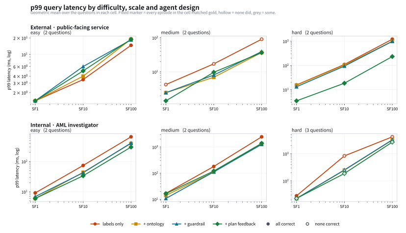
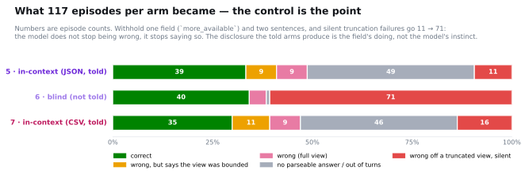
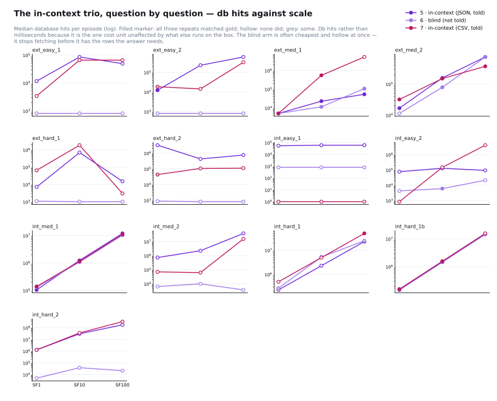
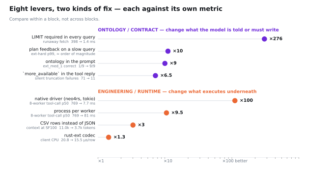

# How an agent's use of a graph database changes as the graph grows

An LDBC-FinBench-shaped anti-money-laundering graph, generated at three scales, with six
money-laundering typologies planted in it at known positions. Thirteen questions, seven agent
designs, 819 measured episodes, and then every query the four scale-axis designs settled on
replayed a hundred times without a model in the loop so the latency figures mean something.
Below the episodes, the interface itself is measured — transport, decoder, runtime, and the
encoding rows wear on their way into the model — so that "why does it get better" has
numbers at every layer.

The thing being measured is not the model and not the database. It is the **exchange** between
them: one question in, an unknown number of Cypher round trips out, and what that shape does
when the graph gets a hundred times bigger.

---

## The headline



Six panels — who is asking, by how hard the question is. Scale factor across, p99 latency up,
one line per agent design, questions within a cell averaged geometrically. **A filled marker
means every episode in the cell matched the gold answer; hollow means none did; grey means
some.** Correctness is on the chart because a latency plot on its own rewards the design that
is cheap for the wrong reason — and one cell here is exactly that case.

What the six panels say:

- **easy, either audience** — the four designs sit on top of each other and all are filled.
  For a one-hop question, what the agent is told does not matter.
- **external / medium** — the separation appears, and it is not only cost. The red line
  (labels only) is *hollow at all three scales* and also the highest. Both wrong and slowest,
  and the gap widens as the graph grows.
- **external / hard** — the green line (plan feedback) sits an order of magnitude below the
  other three at every scale, and stays filled.
- **internal / hard** — grey markers everywhere. Nothing solves the three-layer conjunction
  reliably at any scale, and the reason is not what you would guess. See finding 2.

Per-question detail, for checking any single claim above, is in
[`figures/agent-p99-by-question.svg`](figures/agent-p99-by-question.svg).

---

## What was measured

**Four axes**, chosen so that each one isolates something an operator can actually change.

### Who is asking

Questions are split between an AML investigator inside an institution and a public-facing
service answering on behalf of one customer. This is not a presentational split — the two have
opposite cost profiles:

| | external (public service) | internal (investigator) |
|---|---|---|
| scope | one account, subject-scoped | the whole graph |
| shape | anchored lookup | unanchored pattern search |
| bound | a request SLO | completeness |
| what scale breaks | latency, via the anchor's degree | precision, via false positives |

### How hard — the rule, and where the labels depart from it

The rule as written: `easy` is one hop and one relationship type; `medium` is two hops, or one
hop joined to a second layer; `hard` is three or more layers in conjunction, or an unanchored
pattern search.

Auditing the labels against the reference queries shows the rule does not fully account for
them, and the summary chart averages by these labels, so the discrepancy is stated here rather
than left for a reader to find:

| question | label | relationship types | variable-length | anchored | pattern hops |
|---|---|---|---|---|---|
| `ext_easy_1`, `ext_easy_2` | easy | TRANSFER | – | yes | 1 |
| `ext_med_1` | medium | **TRANSFER only** | – | yes | **1** |
| `ext_med_2` | medium | OWN, TRANSFER | – | yes | 2 |
| `ext_hard_1`, `ext_hard_2` | hard | **TRANSFER only** | **yes** | yes | 1 |
| `int_easy_1` | easy | – | – | no | 0 |
| `int_easy_2` | easy | USES_CHANNEL | – | **no** | 1 |
| `int_med_1` | medium | OWN, TRANSFER | – | no | 3 |
| `int_med_2` | medium | TRANSFER only | – | **no** | 1 |
| `int_hard_1`, `int_hard_1b` | hard | GUARANTEE, OWN, SIGN_IN, TRANSFER | – | no | 6 |
| `int_hard_2` | hard | OWN, TRANSFER | – | no | 2 |

Three departures, and each one names a kind of difficulty the rule does not:

- **`ext_med_1`** is one relationship type, one hop, anchored — `easy` by the rule. It is
  labelled medium because `channel_risk` plausibly lives in two places (on the transfer, and
  on the `Channel` node), so the question is **referentially ambiguous**. That ambiguity is
  what the labels-only design gets wrong.
- **`ext_hard_1` and `ext_hard_2`** are also one relationship type and anchored. They are hard
  because `*1..2` expansion from a power-law anchor is expensive — **traversal cost**, not
  structural depth.
- **"unanchored"** cannot discriminate within the internal class, because every internal
  question is unanchored by construction. That clause of the rule does no work.

So the axis mixes three notions: structural depth, traversal cost, and referential ambiguity.
The consequence for the summary chart is concrete — **`external / hard` measures traversal
cost** (both its questions are variable-length expansions) while **`internal / hard` measures
structural depth** (two of its three are four-relationship conjunctions). They are not the
same kind of hard, which is why the plan-feedback design pulls away in one and not the other.
Re-labelling would mean re-running all 468 episodes; publishing the audit costs nothing and
lets a reader check the label instead of trusting it.

### How big

| | nodes | edges | accounts | max out-degree |
|---|---:|---:|---:|---:|
| SF1 | 4,083 | 25,061 | 2,470 | 767 |
| SF10 | 36,483 | 235,441 | 20,470 | 3,568 |
| SF100 | 360,483 | 2,340,822 | 200,470 | 16,787 |

Same generator, same seed, all ten edge types. The degree distribution is power-law by
construction: the p99 out-degree barely moves (33 → 38 → 37) while the maximum grows 22×. That
is the property that makes the hard questions hard, and it is the one a uniform-attachment
generator does not have.

### What the agent is given

Four designs, each a superset of the one above it, so the difference between two adjacent rows
is attributable to the one thing that changed.

| design | what it adds |
|---|---|
| `labels only` | label and relationship names. Plain text2cypher. |
| `+ ontology` | endpoint types, relationship direction as named roles, declared properties, measured degree hints |
| `+ guardrail` | the ontology is *enforced* on tool arguments before the query reaches the database; a violation returns to the model as text, so a rejection becomes a repair |
| `+ plan feedback` | the query runs under a 2-second probe first; one that does not finish comes back with its plan and an instruction to start from an index, plus an `/* accept-cost */` override |

---

## Results

`gpt-oss-120b` · 13 questions × 3 scales × 4 designs × 3 repeats = **468 episodes** ·
row cap 50 · transaction timeout 60 s.

### Cost

Median db hits per question. db hits rather than milliseconds, because it is the one cost unit
unaffected by what else is running on the machine.

| | SF1 | SF10 | SF100 |
|---|---:|---:|---:|
| **external** — labels only | 24,649 | 91,698 | 719,184 |
| **external** — + ontology | 9,782 | 46,332 | **218,674** |
| **internal** — labels only | 235,921 | 2,227,118 | 22,238,961 |
| **internal** — + ontology | 104,554 | 1,089,714 | **8,119,610** |

### Correctness

| design | correct |
|---|---:|
| labels only | 102/117 |
| + ontology | **108/117** |
| + guardrail | **108/117** |
| + plan feedback | 106/117 |

### The exchange does not get deeper

**Round trips stay at a median of 1.0 at every scale and for every design.** Characters
returned into the model's context stay between 109 and 169. A growing graph does not make
questions deeper and does not flood the context — it makes each hop wider. Everything that
grows, grows inside a single query.

---

## Three findings

### 1. The ontology paid for itself in both currencies at once

`ext_med_1` — *"which accounts sent money to my account over a high-risk channel?"*

| design | db hits (SF100) | p99 (SF100) | correct |
|---|---:|---:|---:|
| labels only | 1,158,923 | 116 ms | **1/9** |
| + ontology | 53,293 | 19 ms | **9/9** |

21.7× cheaper and right instead of wrong. The labels-only design reached the channel through
`Account-[:USES_CHANNEL]->Channel.risk_weight` — a defensible reading of the words, and a
different question with a different answer. The ontology declares that `channel_risk` sits on
the transfer itself.

The general point: accuracy and cost are usually owned by different dashboards and different
people. Here one intervention moved both, and **the wrong answer was also the expensive one.**

### 2. A schema that makes direction legible does not remove ambiguity — it exposes it

Two questions, identical graph, identical schema, identical model, identical scales. The only
difference is the wording.

| question | wording | labels only | + ontology |
|---|---|---:|---:|
| `int_hard_1` | "their owners **guarantee one another**" | 6/9 | **0/9** |
| `int_hard_1b` | "one of them **guarantees the other in either direction**" | 6/9 | **9/9** |

The ontology declares `GUARANTEE` as running `guarantor → guaranteed`. Told that, the model
takes the direction seriously and reads "one another" as *mutual* — writing `(o1)->(o2)` **and**
`(o2)->(o1)`. The graph holds 40,001 `GUARANTEE` edges and **not one reciprocal pair**, so the
answer is empty by construction. The labels-only design, having no direction to commit to,
wrote the undirected form and matched.

This is the same mechanism that produced finding 1, with the opposite sign. Both questions are
kept in the set for exactly that reason — one without the other supports the wrong conclusion.

### 3. Recall is free. Precision is what scale destroys.

Six planted typologies, four scale factors, on the power-law graph. **Recall is 1.00 in all
24 measurements.** Only precision moves:

| rule | SF1 | SF10 | SF100 | SF1000 |
|---|---:|---:|---:|---:|
| nominee structuring | 1.000 | 1.000 | 0.143 | **0.020** |
| layering cycle | 1.000 | 1.000 | 1.000 | **0.111** |
| loan integration | 0.001 | 0.000 | 0.000 | **0.000** |
| funnel account | 1.000 | 1.000 | 1.000 | 1.000 |
| equity integration | 1.000 | 1.000 | 1.000 | 1.000 |
| **common control** | 0.250 | 0.500 | **1.000** | **1.000** |

The two that collapse are the ones resting on a numeric predicate over a single layer.
Nominee structuring is *"owner-level aggregate of sub-threshold legs"* — and at SF1000 it
returns 49 candidates for one real case. The planted gold records why: ranking owners by total
amount **misses it**, because the planted owner sat 100th of 103 owners above the threshold.
Innocent owners reach hundreds of millions on a handful of large legitimate transfers; the ring
reaches twelve million on 468 small ones. Ordinary transfers have a median of ₩28,450 against a
₩10,000,000 reporting threshold, so *"below the reporting threshold"* describes about ninety
percent of normal traffic.

The one that **improves** is a conjunction across three independent layers — transfer, party
guarantee, shared login device — each of them unremarkable alone. The arithmetic is the whole
story: a predicate on one layer keeps a fraction *f* of the graph, so false positives grow as
*f·N*; a conjunction of *k* independent layers keeps ∏*fᵢ*, and when that product shrinks
faster than *N* grows, precision goes **up**.

So the axis that has to scale is not context window or hop count. It is **how many independent
layers the query can reach.**

---

## One level down: the interface itself

The four designs above vary what the agent is *told*. The second half of the work varies the
**exchange** — who does the arithmetic, what encoding the rows wear, and what executes under
the driver.

### Conditions 5–7: the agent does the arithmetic

Three more conditions ([exact prompt diffs](docs/conditions.md)) ban aggregate functions in
Cypher, so the rows land in context and the model computes the answer itself — the measurement
finding 4-as-planned called for. Condition 5 returns rows as JSON and *tells* the agent when a
page was cut (`more_available`); condition 6 is the control that withholds exactly that;
condition 7 is condition 5 with the rows encoded as CSV instead.



- **One tool-response field moves silent failures 71 → 11.** Denied `more_available`, the
  blind control answered wrongly off a truncated view *without saying so* in 71 of 117
  episodes; the told arms did that 11 and 16 times. Accuracy barely moves (39 vs 40 vs 35
  correct) — the field does not make the model right, it makes the model honest, and the
  honesty is the schema's doing, not the model's instinct.
- **CSV carries the same episodes at a third of the context** (median 3.7k vs 11.0k input
  tokens per episode at SF100) with accuracy statistically indistinguishable and *more*
  disclosure, not less. The per-row keys JSON repeats are overhead, not signal — measured
  directly: the same 200 rows are 9,017 tokens as JSON and 5,211 as CSV
  ([the seven-encoding sweep](figures/depth-format-tokens.svg)).
- **Telling the agent has a price**: the told arms page (up to 14 round trips) and ran out of
  their 16-turn budget 47 times; the blind arm stops early, cheap and silently wrong.
  ([by scale](figures/in-context-by-scale.svg), [tokens](figures/in-context-tokens.svg))

Question by question, the same convention as the main figures — scale across, cost up,
marker fill carrying correctness:



The blind arm's flat, hollow lines on the anchored questions are the failure mode drawn: one
page fetched, cheapest cost on the panel, wrong at every scale. And `int_hard_2` is what the
aggregate ban costs at the top end — 10⁸ db hits per episode where condition 4 answered the
same question through one server-side aggregate.

These arms also surfaced a serving artifact worth knowing about: on long multi-page episodes
`gpt-oss-120b` deterministically spends its closing turn in the reasoning channel and returns
empty content. The harness repairs it with one recorded nudge (`nudged` per episode; 6 of 351
fired) so the arms are measured, not the artifact.

### The three boundaries of bridge 2

What a returned row costs, measured at each layer with client CPU, the DB container's cgroup
CPU, tracemalloc, and involuntary context switches (raw samples + a machine manifest per run
in `results/bench/`):

- **Transport** ([figure](figures/depth-runaway.svg)) — a query without LIMIT costs 12 ms on
  Bolt (the client stops pulling), 398 ms on HTTP (the 2.4 MB body is already complete), and
  1.4 ms with LIMIT in the query on either. The 276× spread is closed by the contract, not the
  transport.
- **Runtime** ([figure](figures/depth-driver-cpu.svg)) — consuming a row costs ~7× more CPU
  than producing it (client 20.8 µs vs server 2.9 µs at 100k rows), and the cost is the
  *representation*: a row materialized as a Python dict is 346 bytes against ~30 of data, in
  both decoder builds. The rust codec is a −26% prefactor; the curve does not change.
- **Concurrency** ([figure](figures/depth-scalability.svg)) — the same 8-worker load runs at
  p50 **769 ms** on Python threads (1.3 cores used, the GIL), **81 ms** on eight Python
  processes (7.2 cores — the control that convicts the runtime), and **7.7 ms in one native
  process** (`bench/neo4rs-bench`, tokio) at 2.5 ms CPU per call, because the rows never
  become Python objects. Control plane in Python, data plane native, is the architecture this
  measures its way toward.

### Eight levers, two kinds of fix

Everything above on one closing chart, each lever against the metric it moved, grouped by
what kind of fix it is:



Compare within a block, not across. What the grouping says: **contract-side fixes changed
what the agent does; runtime-side fixes changed what the exchange costs — and neither
substitutes for the other.** No driver makes a model disclose truncation; no prompt makes a
row cost less than 346 bytes in a Python dict.

---

## Reproducing it

**Everything semantic in this experiment is [SEOCHO](https://github.com/tteon/seocho)** — the
ontology object, the prompt schema, and the guardrail are `seocho.ontology` and
`seocho.query`, installed straight from the seocho repository by the first command below. To
rerun anything here, you set up seocho; that is the intended door. Requires Docker, Python
3.10+, and an OpenAI-compatible endpoint.

```bash
pip install -r requirements.txt

# 1. Generate and load three scales (all ten edge types, power-law degree)
for SF in 1 10 100; do
  python scripts/gen_duckdb.py --sf $SF --tag layers \
      --hub-skew 3.0 --dup-share 0.12 --closure-share 0.1 --cycle-share 0.05 \
      --out outputs/finbench
  python scripts/bulk_load.py --src outputs/finbench/sf${SF}-layers \
      --database finbenchl${SF} --password "$NEO4J_PASSWORD"
done

# 2. Run the agents (819 episodes across the seven conditions)
python scripts/agent_interaction.py --password "$NEO4J_PASSWORD" \
    --databases finbenchl1:1 finbenchl10:10 finbenchl100:100 \
    --arms labels ontology guardrail plan in_context in_context_blind in_context_csv \
    --repeats 3 --ontology ontology/finbench.ontology.yaml \
    --out results/agent_interaction.json

# 3. Replay each settled query for a p99 (no model in the loop)
python scripts/replay_p99.py --password "$NEO4J_PASSWORD" \
    --episodes results/agent_interaction.json --iterations 100 --cell-budget 45 \
    --out results/replay_p99.json

# 4. Charts and tables
python scripts/plot_interaction.py --figures figures
python scripts/plot_in_context.py --episodes results/agent_interaction.json
python scripts/report_interaction.py > docs/finbench-agent-interaction.md

# 5. The interface benchmarks (idle DB — they contend with the episodes otherwise)
python scripts/bench_bridge2.py --password "$NEO4J_PASSWORD" --database finbenchl1
python scripts/bench_driver_memory.py --password "$NEO4J_PASSWORD" --database finbenchl1
( cd bench/neo4rs-bench && NEO4J_PASSWORD=$NEO4J_PASSWORD cargo run --release -- finbenchl1 )
python scripts/plot_depth.py && python scripts/plot_levers.py
```

Every benchmark writes machine-readable results to `results/bench/` with per-iteration
samples and a manifest (git commit, decoder, driver versions, container image, CPU) via
`scripts/runmeta.py`, so any number in the figures can be traced to the machine state that
produced it. Run `bench_driver_memory.py` once in a plain-`neo4j` environment and once with
`neo4j-rust-ext` installed to reproduce the decoder comparison.

The generator is deterministic — a fixed seed gives byte-identical row counts and planted
patterns — so step 1 reproduces the same graph. Steps 2 onward involve a language model and
will not reproduce exactly; the committed `results/` are the run the numbers above come from.

The database is [DozerDB](https://dozerdb.org/) `graphstack/dozerdb:5.26.3.0` (Neo4j 5 with
the enterprise features unlocked). Model access goes through any OpenAI-compatible endpoint —
set `MARA_API_KEY` and optionally `MARA_BASE_URL`, or point `agent_interaction.py` at another
provider.

### Layout

```
ontology/finbench.ontology.yaml   the schema, and the subject of finding 1 and 2
scripts/                          generator, loader, runner, replay, benches, plots
bench/neo4rs-bench/               the native end of the driver spectrum (Rust, tokio)
results/                          819 episodes, 156 replayed cells, bench JSONs + manifests
figures/                          thirteen charts
docs/                             conditions.md (generated prompt diffs), tables, defect log
```

`docs/finbench-ontology-defects.md` is worth reading on its own: it records four defects the
experiment found by running agents against the graph and reading what they wrote, with what
each one cost. None of them was visible by inspecting the schema.

---

## What this does not show

Stated plainly, because a result without its limits is a claim.

- **One model.** `gpt-oss-120b` at temperature 0. The design differences are large, but
  whether they hold across model families is untested — the endpoint also serves
  DeepSeek-V3.x and MiniMax, so the model axis is one flag away.
- **Three repeats per cell.** Enough to see the in-context arms' failure-mode gap (71 vs 11
  is not noise), thin for small accuracy differences — the 35-vs-39 CSV comparison needs
  bootstrap intervals before it is quoted as anything but "indistinguishable".
- **Synthetic data.** The graph is generated to LDBC FinBench's shape and its typologies come
  from FATF and FinCEN guidance, but it is not a real institution's data. Validation against
  the LDBC FinBench reference dataset is open.
- **The interface benchmarks share one box with the database.** Client and server CPU are
  charged separately (process rusage vs container cgroup), but a cross-machine run would
  add the network back into bridge 2; the runaway asymmetry only widens there.
- **`int_hard_1` at SF100 has no in-run gold.** The hand-written reference query takes **777
  seconds** at that scale, past the run's gold timeout; it was computed separately and the
  affected episodes re-scored. That number is itself a result — the optimal query for the
  hardest question no longer returns in reasonable time, which is what an agent working inside
  a 60-second budget is up against.

---

## Provenance

The ontology, guardrail and OpenAI Agents SDK adapter live upstream in
[tteon/seocho](https://github.com/tteon/seocho), pinned by the tag
[`finbench-agent-scale-v1`](https://github.com/tteon/seocho/releases/tag/finbench-agent-scale-v1)
in `requirements.txt` — a tag rather than a branch, because the branch goes away when its pull
request merges and a squash merge lands a different commit on main. This repository holds the
experiment. Three functions do the work that findings 1 and 2 are about —
`policy_from_ontology`, `schema_for_prompt` and `validate_text2cypher_fallback` — and they are
169 lines between them, which is worth knowing before assuming the result requires a framework.

The pin is for reproducing the published results. To check that an installed seocho — the
tag, or any newer one — still runs this experiment, `python scripts/smoke_seocho.py`
exercises exactly the three functions above against this repo's ontology: the schema still
renders the facts findings 1 and 2 rest on, the guardrail still accepts a conforming query
and still refuses an unscoped one. The CSV row encoding condition 7 measures here was
upstreamed as seocho's `row_format` option
([tteon/seocho#466](https://github.com/tteon/seocho/pull/466)) — the experiment fed the
middleware, which is the direction the pin is meant to point.
