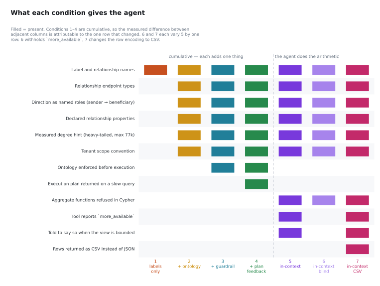

# The seven conditions, and exactly how their prompts differ

Generated by `scripts/dump_conditions.py` from `agent_interaction.py`. Do not edit by hand — the point of generating it is that a description of a prompt cannot drift from the prompt.

Conditions 1–4 are cumulative: each adds one thing to the previous, so the measured difference between two adjacent conditions is attributable to that one thing. Conditions 5–7 are not part of that chain. They move the arithmetic out of the database, and 6 and 7 each vary condition 5 along one axis: 6 withholds the truncation signal, 7 changes the row encoding from JSON to CSV.

| | condition | schema | rules | row cap | turn budget |
|---|---|---:|---:|---:|---:|
| 1 | `labels` | 1,160 chars | 686 chars | 50 | 8 |
| 2 | `ontology` | 2,725 chars | 686 chars | 50 | 8 |
| 3 | `guardrail` | 2,725 chars | 686 chars | 50 | 8 |
| 4 | `plan` | 2,725 chars | 911 chars | 50 | 8 |
| 5 | `in_context` | 2,725 chars | 1,137 chars | 200 | 16 |
| 6 | `in_context_blind` | 2,725 chars | 866 chars | 200 | 16 |
| 7 | `in_context_csv` | 2,725 chars | 1,263 chars | 200 | 16 |



---

## 1 · labels only

Label and relationship names only. Plain text2cypher, and the baseline every other condition is measured against.

This is the baseline. Its full rules block:

```
Rules:
- Every node pattern must carry the workspace scope, written exactly as {_workspace_id: $workspace_id}. The harness supplies $workspace_id, $limit and (where the question names an account) $a; you do not need to define them, and you must not inline their values.
- Refer to an account the question names by binding acct_no to the $a parameter, not by inlining the number.
- End every query with LIMIT $limit.
- Call the tool as many times as you need, then answer.

Finish your reply with a single line of the form:
ANSWER: <json>
where <json> is a JSON object for a question asking for named values, or a JSON array for a question asking for a list. Put nothing after that line.
```

---

## 2 · + ontology

The same, plus what a list of labels cannot say: which end of a same-label relationship the anchor sits on, which types each relationship actually connects, which properties exist and where they live, and how heavy the degree tail is.

**Rules added over `labels`:**

_None — the rules are identical._

The rules text does not change at all here. Everything condition 2 adds is in the **schema block**, which grows from 778 to 2,311 characters: endpoint types, a `__direction__` line per relationship naming its roles, a `__cardinality__` line carrying the measured degree tail, and the tenant scope convention. That is the entire intervention, and it is what takes `ext_med_1` from 1/9 to 9/9.

---

## 3 · + guardrail

The ontology is now *enforced*. Generated Cypher is checked against it before the query reaches the database; a violation comes back to the model as text, so a rejection becomes a repair rather than a failure.

**Rules added over `ontology`:**

_None — the rules are identical._

Also not in the prompt: this condition adds enforcement *outside* it. Before any query executes, the generated Cypher is checked against the ontology — declared labels, relationship types, properties, bounded paths, tenant scope and a row budget. A violation is returned to the model as text and it rewrites.

---

## 4 · + plan feedback

The query runs under a two-second probe first. One that does not finish comes back with its plan operators and an instruction to start from an index — with an `/* accept-cost */` override, because an investigator's questions are unanchored by nature and a gate with no escape hatch is a policy against asking them.

**Rules added over `guardrail`:**

```diff
+- The tool runs EXPLAIN before executing. If the plan scans all nodes or the planner estimates too many rows, the query is refused and you are given the plan. Rewrite it to start from an indexed lookup and to filter earlier.
```

The gate is on **measured elapsed time**, not on the planner's row estimate. That was the first design and it fired zero times in 108 episodes: across the 48 queries settled on at SF100, actual db hits ran from 2.9× to 4,617,254× the summed `EstimatedRows`, because that figure is per-operator output cardinality and the work is in the expansion.

---

## 5 · in-context aggregation

The arithmetic moves out of the database. Aggregate functions are refused in Cypher, so the agent must fetch rows and compute the answer itself. The tool caps each page and *reports* when more rows existed.

**Rules added over `ontology`:**

```diff
+- You may NOT use aggregate functions in Cypher (count, sum, avg, min, max, collect, percentile). Return the underlying rows and compute the answer yourself from what you receive.
+- The tool caps each call at 200 rows and reports `more_available` when there were more; page through with SKIP/ORDER BY if you need them.
+- If you cannot see all the rows the answer depends on, say so in your reply instead of answering from the rows you happen to have.
```

---

## 6 · in-context, blind (control)

The control for condition 5, withholding one thing: the tool does not say whether more rows existed, and the instructions never mention that a result can be bounded. Everything else is identical.

**Rules added over `in_context`:**

```diff
-- The tool caps each call at 200 rows and reports `more_available` when there were more; page through with SKIP/ORDER BY if you need them.
-- If you cannot see all the rows the answer depends on, say so in your reply instead of answering from the rows you happen to have.
```

**The tool response also differs, in one field.** Condition 5 returns `{rows, row_count, row_cap, more_available}`; condition 6 returns `{rows, row_count}`. Nothing else about the two conditions differs — same row cap, same turn budget, same aggregate ban, same schema, same model, same temperature.

The pair separates two explanations that were previously conflated: *the model does not disclose that its answer rests on a truncated view*, and *the model was never told the view was truncated*. Those have different fixes — one is a prompt or model problem, the other is one line of a tool response schema.

---

## 7 · in-context, CSV rows

Condition 5 with one thing changed: the rows come back as CSV instead of JSON. Same fields, same cap, same `more_available` — but the column names are paid for once in a header line rather than once per row, which on 200 rows of this graph's shape is 58% of the JSON payload's tokens. The question is whether the cheaper encoding costs anything in in-context arithmetic or truncation disclosure.

**Rules added over `in_context`:**

```diff
-- The tool caps each call at 200 rows and reports `more_available` when there were more; page through with SKIP/ORDER BY if you need them.
+- The tool caps each call at 200 rows and returns them as CSV: a header line, one line per row, and a final line of the form `# row_count=<n> row_cap=<n> more_available=<true|false>` reporting when there were more; page through with SKIP/ORDER BY if you need them.
```

**The tool response differs in encoding, not in content.** Condition 5 returns `{rows, row_count, row_cap, more_available}` as JSON; condition 7 returns the same rows as a CSV header line plus one line per row, and the same metadata as a trailing `# row_count=… row_cap=… more_available=…` line. Measured on 200 rows of this graph's shape with the o200k tokenizer: 9,017 tokens as JSON, 5,211 as CSV (58%), because JSON pays for the column names once per row and CSV pays once per page.
